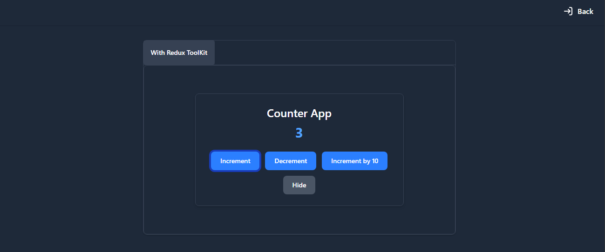

# Counter Project using Redux and ReduxToolKit

It show the counter project using vanila reduxa and reduxtoolkit to demonestrate the 
difference between redux and reduxtoolkit.
## Screeshot

## How to setup

1. Clone the repository
2. Run `npm install`
3. Run `npm start`
4. Open http://localhost:3000
